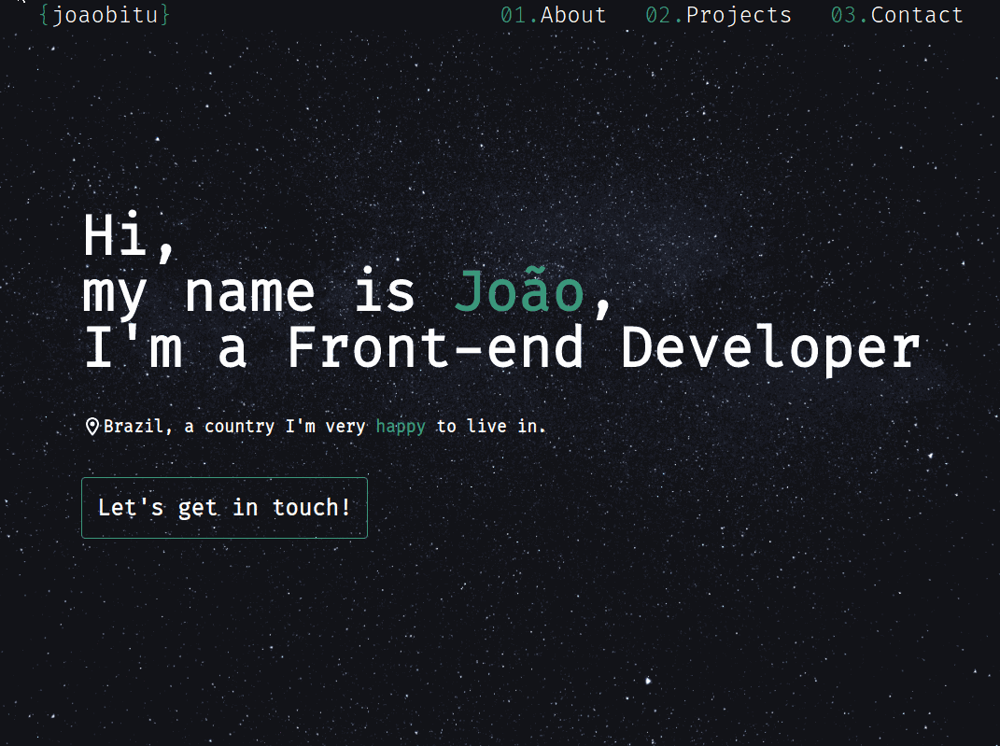

# Portfolio Website

A practical Hub with all things João in it!

## Functionalities

- Fully Responsive between mobile and full HD resolutions
- Smooth resizing and in page scrolling
- Animated, sortable projects section
- A sticky navigation that moves out of your way when you do not need it
- A form that actually directs messages to me, using Fromspring

## Practiced Skills

This was my first project using TailwindCSS! and honestly it is quite a bit of a shock going from a CSS style sheet to inline classes to style my componenents, there are some tweaks I still need to make but having that kind of proximity between componenent and styling makes sense, as explained in [here](https://www.youtube.com/watch?v=CQuTF-bkOgc&ab_channel=Theo-t3%E2%80%A4gg).

Something else that I considered for the first time was the actual UX of the website, I wanted all of the portfolio to be easily accessible, one thing that really helped with it was the way I handled the navigation bar:

Responsiveness was also a very important issue for me, especially since these days [mobile is more prevalent than computers](https://www.oberlo.com/statistics/mobile-internet-traffic#:~:text=As%20of%20November%202022%2C%2049.78,internet%20users%20in%20the%20US.)

Oh, also, I wanna shoutout [this person from behance](https://www.behance.net/gallery/157263277/Portofolio-web-Frontend-developer-inspired), as I implemented their design to make my website!

Overall it was very rewarding to do something pretty for a change!

## Technologies

- 
- 
- 
- 
- 
- 
- 

## Improvements

I believe this website could evidently still benefit from some imporvements, wich I may or may not do in the future:

- Improve the scrolling through menus experience on mobile.
- Projects section could be prettier, the buttons on the cards there are also problematic
- Use a color with better contrast for socials SVG's
- Adding portuguese support.

## Links

- [Live version](https://polite-strudel-3cec49.netlify.app/)
